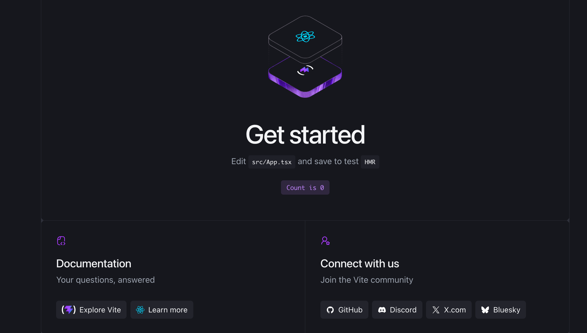

/////////////////
App.tsx 初期設定の解説 
/////////////////
「初期画面専用：useState,reactLogo,viteLogo,heroImg」
    import { useState } from 'react' ---Reactの「状態を管理する機能」を読み込む
    import reactLogo from './assets/react.svg' ---Reactロゴ画像を読み込む
    import viteLogo from './assets/vite.svg' ---Viteロゴ画像を読み込む
    import heroImg from './assets/hero.png' ---初期画面上部の画像を読み込む
    import './App.css' ---App.tsx用のCSSを読み込む

// function App() {} ---AppというReact Componentを作成

// const [count, setCount] = useState(0) ---ブラウザにある「Count is 0」のためのコード
    const [
        count,      // 現在の数字
        setCount    // 数字を変更する関数
    ] = useState(0) // 最初は0

// ボタンをクリック → setCount → countを+1 → Reactが画面を再表示
button
onClick={() => setCount((count) => count + 1)}

// return以降が画面部分
  return ()
    <> ---フラグメント
        ※NG記入例（２つ並べて記入不可）
        return (
        <h1>タイトル</h1>
        
文章

        )

        ※正しい記入例（<>があることによってまとめて書ける）
        return (
            <>
                <h1>タイトル</h1>
                
文章

            </>
        )

// Appを他のファイルから使えるようにする
export default App ---最後の行にある
    main.tsx → App.tsxを呼ぶ → App.tsxのreturn → ブラウザに表示

